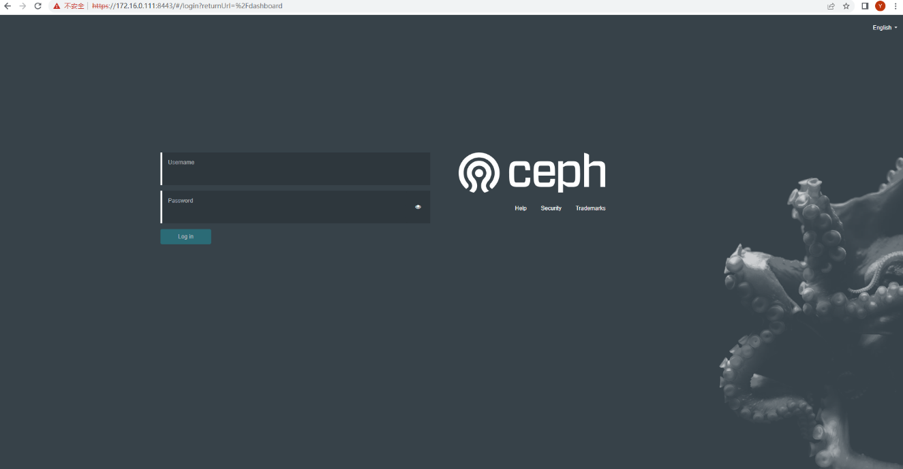
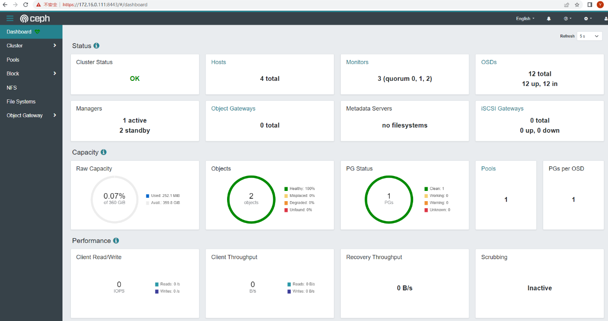

## 一、Ceph集群规划
|ID  |服务器IP     |主机名           |系统版本  |磁盘                        |
|:-: |:-:          |:-               |:-:       |:-:                         |
|1   |172.16.0.111 |ceph01,registry  |Rocky8.7  |/dev/vdb,/dev/vdc,/dev/vdd  |
|2   |172.16.0.112 |ceph02           |Rocky8.7  |/dev/vdb,/dev/vdc,/dev/vdd  |
|3   |172.16.0.113 |ceph03           |Rocky8.7  |/dev/vdb,/dev/vdc,/dev/vdd  |
|4   |172.16.0.114 |ceph04           |Rocky8.7  |/dev/vdb,/dev/vdc,/dev/vdd  |


## 二、基础环境配置
#### 1、调整hosts：
```shell
[root@ceph01 ~]# vi /etc/hosts
...
172.16.0.111 ceph01 registry
172.16.0.112 ceph02
172.16.0.113 ceph03
172.16.0.114 ceph04
```

#### 2、配置ceph01到其它节点免密：
```shell
[root@ceph01 ~]# ssh-keygen
[root@ceph01 ~]# ssh-copy-id root@ceph02
[root@ceph01 ~]# ssh-copy-id root@ceph03
[root@ceph01 ~]# ssh-copy-id root@ceph04
```

#### 3、配置离线源：
```shell
[root@ceph01 ~]# vi /etc/yum.repos.d/Local.repo 


[baseos]
name=Rocky Linux $releasever - BaseOS
baseurl=file:///media/BaseOS/
enabled=1
countme=1
gpgcheck=0
gpgkey=file:///etc/pki/rpm-gpg/RPM-GPG-KEY-rockyofficial


[appstream]
name=Rocky Linux $releasever - AppStream
baseurl=file:///media/AppStream/
enabled=1
countme=1
gpgcheck=0
gpgkey=file:///etc/pki/rpm-gpg/RPM-GPG-KEY-rockyofficial


```
```shell
[root@ceph01 ~]# mount -o loop Rocky-8.7-x86_64-dvd1.iso /media/
mount: /media: WARNING: device write-protected, mounted read-only.
[root@ceph01 ~]# dnf makecache
```

#### 4、安装依赖python3、lvm2
```shell
[root@ceph01 ~]# dnf install python3 lvm2
```

#### 5、配置时间同步：
```shell
[root@ceph01 ~]# dnf install chrony
[root@ceph01 ~]# vi /etc/chrony.conf
...
pool ntp.speech.local iburst
...
[root@ceph01 ~]# systemctl restart chronyd
[root@ceph01 ~]# chronyc -a makestep
200 OK
```

#### 6、离线部署docker：
```shell
[root@ceph01 ~]# cd ceph-v17.2.6/1.docker-ce
[root@ceph01 1.docker-ce]# dnf localinstall *
```

#### 7、调整docker配置文件，指定registry：
```shell
[root@ceph01 ~]# vi /etc/docker/daemon.json
{
  "insecure-registries": ["registry:5000"],
  "exec-opts": ["native.cgroupdriver=systemd"]
}
```
```shell
[root@ceph01 ~]# systemctl restart docker
```


## 三、部署registry（仅在ceph01部署）
#### 1、导入registry镜像：
```shell
[root@ceph01 ~]# cd ceph-v17.2.6/2.registry/
[root@ceph01 2.registry]# ./load.sh
```

#### 2、启动私有registry：
```shell
[root@ceph01 ~]# docker run -d --name registry --restart always -p 5000:5000 -v /var/lib/registry:/var/lib/registry registry:2.8.2
```


## 四、导入ceph镜像
#### 1、导入ceph相关镜像（所有节点都需要）：
```shell
[root@ceph01 ~]# cd ceph-v17.2.6/2.docker-images
[root@ceph01 2.docker-images]# ./load.sh
[root@ceph01 2.docker-images]# docker images
REPOSITORY                         TAG                IMAGE ID       CREATED         SIZE
quay.io/ceph/ceph                  v17                52bedc025a3c   3 weeks ago     1.16GB
quay.io/ceph/ceph                  v17.2.6-20230601   52bedc025a3c   3 weeks ago     1.16GB
quay.io/ceph/ceph-grafana          8.3.5              dad864ee21e9   14 months ago   558MB
quay.io/prometheus/prometheus      v2.33.4            514e6a882f6e   16 months ago   204MB
quay.io/ceph/keepalived            2.1.5              9f7bdb4a87fd   16 months ago   214MB
quay.io/ceph/haproxy               2.3                e85424b0d443   17 months ago   99.3MB
quay.io/prometheus/node-exporter   v1.3.1             1dbe0e931976   18 months ago   20.9MB
grafana/loki                       2.4.0              24d3d94c71c7   19 months ago   62.5MB
grafana/promtail                   2.4.0              f568284f5b06   19 months ago   179MB
quay.io/prometheus/alertmanager    v0.23.0            ba2b418f427c   22 months ago   57.5MB
maxwo/snmp-notifier                v1.2.1             7ca9dd8b3f09   22 months ago   13.2MB
```

#### 2、推送ceph镜像到私有仓库：
```shell
[root@ceph01 ~]# docker tag quay.io/ceph/ceph:v17 registry:5000/ceph:v17
[root@ceph01 ~]# docker push registry:5000/ceph:v17
```


## 五、安装cephadm、ceph-common（仅管理节点）
#### 1、安装cephadm
```shell
[root@ceph01 ~]# cp ceph-v17.2.6/4.cephadm/cephadm /usr/sbin
```

#### 2、安装依赖：
```shell
[root@ceph01 ~]# cd ceph-v17.2.6/5.ceph/1.epel-dependent/
[root@ceph01 1.epel-dependent]# dnf localinstall *
```

#### 3、安装ceph-common：
```shell
[root@ceph01 1.epel-dependent]# cd ../2.ceph/
[root@ceph01 2.ceph]# dnf localinstall *
```


## 六、初始化集群
#### 1、初始化集群：
```shell
[root@ceph01 ~]# cephadm --image registry:5000/ceph:v17 bootstrap --mon-ip 172.16.0.111 --skip-pull
Verifying podman|docker is present...
Verifying lvm2 is present...
Verifying time synchronization is in place...
Unit chronyd.service is enabled and running
Repeating the final host check...
docker (/usr/bin/docker) is present
systemctl is present
lvcreate is present
Unit chronyd.service is enabled and running
Host looks OK
Cluster fsid: f0a7abc8-16ec-11ee-a634-5254009a2a54
Verifying IP 172.16.0.111 port 3300 ...
Verifying IP 172.16.0.111 port 6789 ...
Mon IP `172.16.0.111` is in CIDR network `172.16.0.0/24`
Mon IP `172.16.0.111` is in CIDR network `172.16.0.0/24`
Internal network (--cluster-network) has not been provided, OSD replication will default to the public_network
Ceph version: ceph version 17.2.6 (d7ff0d10654d2280e08f1ab989c7cdf3064446a5) quincy (stable)
Extracting ceph user uid/gid from container image...
Creating initial keys...
Creating initial monmap...
Creating mon...
Waiting for mon to start...
Waiting for mon...
mon is available
Assimilating anything we can from ceph.conf...
Generating new minimal ceph.conf...
Restarting the monitor...
Setting mon public_network to 172.16.0.0/24
Wrote config to /etc/ceph/ceph.conf
Wrote keyring to /etc/ceph/ceph.client.admin.keyring
Creating mgr...
Verifying port 9283 ...
Waiting for mgr to start...
Waiting for mgr...
mgr not available, waiting (1/15)...
mgr not available, waiting (2/15)...
mgr not available, waiting (3/15)...
mgr not available, waiting (4/15)...
mgr is available
Enabling cephadm module...
Waiting for the mgr to restart...
Waiting for mgr epoch 5...
mgr epoch 5 is available
Setting orchestrator backend to cephadm...
Generating ssh key...
Wrote public SSH key to /etc/ceph/ceph.pub
Adding key to root@localhost authorized_keys...
Adding host ceph01...
Deploying mon service with default placement...
Deploying mgr service with default placement...
Deploying crash service with default placement...
Deploying ceph-exporter service with default placement...
Deploying prometheus service with default placement...
Deploying grafana service with default placement...
Deploying node-exporter service with default placement...
Deploying alertmanager service with default placement...
Enabling the dashboard module...
Waiting for the mgr to restart...
Waiting for mgr epoch 9...
mgr epoch 9 is available
Generating a dashboard self-signed certificate...
Creating initial admin user...
Fetching dashboard port number...
Ceph Dashboard is now available at:

         URL: https://ceph01:8443/
        User: admin
    Password: ue68ni7ifv

Enabling client.admin keyring and conf on hosts with "admin" label
Saving cluster configuration to /var/lib/ceph/f0a7abc8-16ec-11ee-a634-5254009a2a54/config directory
Enabling autotune for osd_memory_target
You can access the Ceph CLI as following in case of multi-cluster or non-default config:

    sudo /usr/sbin/cephadm shell --fsid f0a7abc8-16ec-11ee-a634-5254009a2a54 -c /etc/ceph/ceph.conf -k /etc/ceph/ceph.client.admin.keyring

Or, if you are only running a single cluster on this host:

    sudo /usr/sbin/cephadm shell 

Please consider enabling telemetry to help improve Ceph:

    ceph telemetry on

For more information see:

    https://docs.ceph.com/docs/master/mgr/telemetry/

Bootstrap complete.
```

#### 2、复制集群公钥到其它节点：
```shell
[root@ceph01 ~]# ssh-copy-id -f -i /etc/ceph/ceph.pub root@ceph02
[root@ceph01 ~]# ssh-copy-id -f -i /etc/ceph/ceph.pub root@ceph03
[root@ceph01 ~]# ssh-copy-id -f -i /etc/ceph/ceph.pub root@ceph04
```

#### 3、ceph01打上管理员标签：
```shell
[root@ceph01 ~]# ceph orch host label add ceph01 _admin
Added label _admin to host ceph01
[root@ceph01 ~]# ceph orch host ls
HOST    ADDR          LABELS  STATUS  
ceph01  172.16.0.111  _admin          
1 hosts in cluster
```

#### 4、添加节点ceph02、ceph03、ceph04到集群
```shell
[root@ceph01 ~]# ceph orch host add ceph02 172.16.0.112
Added host 'ceph02' with addr '172.16.0.112'
[root@ceph01 ~]# ceph orch host add ceph03 172.16.0.113
Added host 'ceph03' with addr '172.16.0.113'
[root@ceph01 ~]# ceph orch host add ceph04 172.16.0.114
Added host 'ceph04' with addr '172.16.0.114'
```

#### 5、添加mon
```shell
[root@ceph01 ~]# ceph orch apply mon "ceph01,ceph02,ceph03"
Scheduled mon update...
```

#### 6、添加mgr
```shell
[root@ceph01 ~]# ceph orch apply mgr "ceph01,ceph02,ceph03"
Scheduled mgr update...
```

#### 7、添加osd
```shell
[root@ceph01 ~]# ceph orch apply osd --all-available-devices  # 使用所有可用设备
Scheduled osd.all-available-devices update...
```
```shell
[root@ceph01 ~]# ceph orch daemon add osd ceph01:/dev/vdb     # 或手动添加所有设备，二选一
[root@ceph01 ~]# ceph orch daemon add osd ceph01:/dev/vdc
[root@ceph01 ~]# ceph orch daemon add osd ceph01:/dev/vdd
```
```shell
[root@ceph01 ~]# ceph osd tree                                # 查看osd
ID  CLASS  WEIGHT   TYPE NAME        STATUS  REWEIGHT  PRI-AFF
-1         0.35156  root default                              
-9         0.08789      host ceph01                           
 3    hdd  0.02930          osd.3        up   1.00000  1.00000
 7    hdd  0.02930          osd.7        up   1.00000  1.00000
11    hdd  0.02930          osd.11       up   1.00000  1.00000
-3         0.08789      host ceph02                           
 2    hdd  0.02930          osd.2        up   1.00000  1.00000
 5    hdd  0.02930          osd.5        up   1.00000  1.00000
 8    hdd  0.02930          osd.8        up   1.00000  1.00000
-7         0.08789      host ceph03                           
 1    hdd  0.02930          osd.1        up   1.00000  1.00000
 4    hdd  0.02930          osd.4        up   1.00000  1.00000
 9    hdd  0.02930          osd.9        up   1.00000  1.00000
-5         0.08789      host ceph04                           
 0    hdd  0.02930          osd.0        up   1.00000  1.00000
 6    hdd  0.02930          osd.6        up   1.00000  1.00000
10    hdd  0.02930          osd.10       up   1.00000  1.00000
```

#### 8、查看集群状态：
```shell
[root@ceph01 ~]# ceph -s
  cluster:
    id:     f0a7abc8-16ec-11ee-a634-5254009a2a54
    health: HEALTH_OK
 
  services:
    mon: 3 daemons, quorum ceph01,ceph02,ceph03 (age 62m)
    mgr: ceph01.gwcwvz(active, since 97m), standbys: ceph02.ztsjzq, ceph03.otsafz
    osd: 12 osds: 12 up (since 6m), 12 in (since 7m)
 
  data:
    pools:   1 pools, 1 pgs
    objects: 2 objects, 449 KiB
    usage:   252 MiB used, 360 GiB / 360 GiB avail
    pgs:     1 active+clean

```

#### 9、通过浏览器访问 https://172.16.0.111:8443 打开ceph控制台：




## 七、部署CephFS
#### 1、创建纠删码规则（注意：故障域为osd级别，默认host级别对于4+2最少需要6个节点）：
```shell
[root@ceph01 ~]# ceph osd erasure-code-profile set ec k=4 m=2 crush-failure-domain=osd --force
```
```shell
[root@ceph01 ~]# ceph osd erasure-code-profile get ec   # 查看
crush-device-class=
crush-failure-domain=osd
crush-root=default
jerasure-per-chunk-alignment=false
k=4
m=2
plugin=jerasure
technique=reed_sol_van
w=8
```

#### 2、创建 crush rule：
```shell
[root@ceph01 ~]# ceph osd crush rule create-erasure ec ec
created rule ec at 1
```

#### 3、创建元数据池：
```shell
[root@ceph01 ~]# ceph osd pool create cephfs-metadata 32 32
pool 'cephfs-metadata' created
```
```shell
[root@ceph01 ~]# ceph osd pool application enable cephfs-metadata cephfs
enabled application 'cephfs' on pool 'cephfs-metadata'
```

#### 4、创建纠删码池：
```shell
[root@ceph01 ~]# ceph osd pool create cephfs-data 128 128 erasure ec ec
pool 'cephfs-data' created
```
```shell
[root@ceph01 ~]# ceph osd pool set cephfs-data min_size 6
set pool 3 min_size to 6
```
```shell
[root@ceph01 ~]# ceph osd pool set cephfs-data allow_ec_overwrites true
set pool 3 allow_ec_overwrites to true
```
```shell
[root@ceph01 ~]# ceph osd pool application enable cephfs-data cephfs
enabled application 'cephfs' on pool 'cephfs-data'
```

#### 5、创建cephfs：
```shell
[root@ceph01 ~]# ceph fs new cephfs cephfs-metadata cephfs-data --force
new fs with metadata pool 2 and data pool 3
```

#### 6、部署mds：
```shell
[root@ceph01 ~]# ceph orch apply mds cephfs "ceph01,ceph02,ceph03"
Scheduled mds.cephfs update...
```

#### 7、查看进程：
```shell
[root@ceph01 ~]# ceph orch ps
NAME                  HOST    PORTS        STATUS         REFRESHED  AGE  MEM USE  MEM LIM  VERSION  IMAGE ID      CONTAINER ID  
alertmanager.ceph01   ceph01  *:9093,9094  running (2d)      2m ago   2d    44.7M        -  0.23.0   ba2b418f427c  0ac83e4d858a  
ceph-exporter.ceph01  ceph01               running (2d)      2m ago   2d    17.2M        -  17.2.6   52bedc025a3c  38fc6777676d  
ceph-exporter.ceph02  ceph02               running (2d)      5m ago   2d    17.5M        -  17.2.6   52bedc025a3c  7f3232ddc9bb  
ceph-exporter.ceph03  ceph03               running (2d)      5m ago   2d    17.4M        -  17.2.6   52bedc025a3c  0bd6747ddc3f  
ceph-exporter.ceph04  ceph04               running (2d)      5m ago   2d    17.4M        -  17.2.6   52bedc025a3c  6cdbf48558f9  
crash.ceph01          ceph01               running (2d)      2m ago   2d    8863k        -  17.2.6   52bedc025a3c  7704c2e1d2cc  
crash.ceph02          ceph02               running (2d)      5m ago   2d    7067k        -  17.2.6   52bedc025a3c  f5a0ea38f48a  
crash.ceph03          ceph03               running (2d)      5m ago   2d    7067k        -  17.2.6   52bedc025a3c  ae68215f5647  
crash.ceph04          ceph04               running (2d)      5m ago   2d    7063k        -  17.2.6   52bedc025a3c  37ade5ea20e3  
grafana.ceph01        ceph01  *:3000       running (2d)      2m ago   2d     116M        -  8.3.5    dad864ee21e9  f562a2aee4eb  
mgr.ceph01.petpvx     ceph01  *:9283       running (2d)      2m ago   2d     464M        -  17.2.6   52bedc025a3c  0300ea196c1b  
mgr.ceph02.juwtyb     ceph02  *:8443,9283  running (2d)      5m ago   2d     420M        -  17.2.6   52bedc025a3c  3ada49d4d984  
mgr.ceph03.wmievm     ceph03  *:8443,9283  running (2d)      5m ago   2d     589M        -  17.2.6   52bedc025a3c  0ddf9be07845  
mon.ceph01            ceph01               running (2d)      2m ago   2d     401M    2048M  17.2.6   52bedc025a3c  057c47b5094a  
mon.ceph02            ceph02               running (2d)      5m ago   2d     401M    2048M  17.2.6   52bedc025a3c  caeca5451e43  
mon.ceph03            ceph03               running (2d)      5m ago   2d     400M    2048M  17.2.6   52bedc025a3c  784c46073593  
node-exporter.ceph01  ceph01  *:9100       running (2d)      2m ago   2d    32.6M        -  1.3.1    1dbe0e931976  4a9fa0b237e9  
node-exporter.ceph02  ceph02  *:9100       running (2d)      5m ago   2d    27.3M        -  1.3.1    1dbe0e931976  27b5e7a2d2ad  
node-exporter.ceph03  ceph03  *:9100       running (2d)      5m ago   2d    27.0M        -  1.3.1    1dbe0e931976  58339e0745eb  
node-exporter.ceph04  ceph04  *:9100       running (2d)      5m ago   2d    25.2M        -  1.3.1    1dbe0e931976  96fdaa888e11  
osd.0                 ceph04               running (71m)     5m ago   2d    58.0M    3012M  17.2.6   52bedc025a3c  0e677e04b40b  
osd.1                 ceph03               running (71m)     5m ago   2d    58.4M    1305M  17.2.6   52bedc025a3c  91db3372353b  
osd.2                 ceph02               running (72m)     5m ago   2d    58.9M    1305M  17.2.6   52bedc025a3c  be48d141a391  
osd.3                 ceph01               running (36m)     2m ago  36m    46.7M    4096M  17.2.6   52bedc025a3c  5156eb6d82e7  
osd.4                 ceph03               running (71m)     5m ago   2d    77.7M    1305M  17.2.6   52bedc025a3c  7a04ee94c9ff  
osd.5                 ceph02               running (71m)     5m ago   2d    59.7M    1305M  17.2.6   52bedc025a3c  8be2b3e786d0  
osd.6                 ceph04               running (71m)     5m ago   2d    78.5M    3012M  17.2.6   52bedc025a3c  24c1d0a84f65  
osd.7                 ceph01               running (72m)     2m ago   2d    78.7M    4096M  17.2.6   52bedc025a3c  819b8b24c164  
osd.8                 ceph02               running (71m)     5m ago   2d    81.5M    1305M  17.2.6   52bedc025a3c  012bd75f8bf6  
osd.9                 ceph03               running (71m)     5m ago   2d    82.1M    1305M  17.2.6   52bedc025a3c  2ac2debf38c3  
osd.10                ceph04               running (71m)     5m ago   2d    61.1M    3012M  17.2.6   52bedc025a3c  4491dce2bec8  
osd.11                ceph01               running (14m)     2m ago  14m    42.8M    4096M  17.2.6   52bedc025a3c  a24452a09ea8  
prometheus.ceph01     ceph01  *:9095       running (2d)      2m ago   2d     197M        -  2.33.4   514e6a882f6e  7e0b9e254ed6  
```


## 八、客户端挂载CephFS
#### 1、客户端安装ceph-common：
```shell
root@node01:~# apt install ceph-common
```

#### 2、挂载cephfs：
```shell
root@node01:~# mount -t ceph -o name=admin,secret=AQBdPJ5kvd07NxAAeVV....... 172.16.0.111:6789,172.16.0.112:6789,172.16.0.113:6789:/ /mnt/
```
```shell
root@node01:~# df -hT
Filesystem                                              Type      Size  Used Avail Use% Mounted on
...
172.16.0.111:6789,172.16.0.112:6789,172.16.0.113:6789:/ ceph      228G     0  228G   0% /mnt
```

#### 3、写数据测试：
```shell
root@node01:~# cd /mnt/
root@node01:/mnt# dd if=/dev/zero of=10G bs=1M count=10240
10240+0 records in
10240+0 records out
10737418240 bytes (11 GB, 10 GiB) copied, 3.62128 s, 3.0 GB/s
```

#### 4、读数据测试：
```shell
root@node01:/mnt# dd if=10G of=/dev/null bs=1M count=10240
10240+0 records in
10240+0 records out
10737418240 bytes (11 GB, 10 GiB) copied, 1.30639 s, 8.2 GB/s
```


## 九、故障盘替换
#### 1、确定osd对应的磁盘：
```shell
[root@ceph01 ~]# ceph osd metadata osd.3
```

#### 2、停止osd容器：
```shell
[root@ceph01 ~]# ceph orch daemon stop osd.3
Scheduled to stop osd.3 on host 'ceph01'
```

#### 3、从集群中移除osd：
```shell
[root@ceph01 ~]# ceph osd out osd.3
marked out osd.3. 
```

#### 4、从crush map中移除osd：
```shell
[root@ceph01 ~]# ceph osd crush remove osd.3
removed item id 3 name 'osd.3' from crush map
```

#### 5、删除osd身份认证秘钥：
```shell
[root@ceph01 ~]# ceph auth del osd.3
```

#### 6、删除osd：
```shell
[root@ceph01 ~]# ceph osd rm osd.3
removed osd.3
```
```shell
[root@ceph01 ~]# ceph orch daemon rm osd.3 --force
Removed osd.3 from host 'ceph01'
```

#### 7、替换故障盘（一般服务器都支持热插拔）

#### 8、擦除新磁盘：
```shell
[root@ceph01 ~]# ceph orch device zap ceph01 /dev/vdb --force
zap successful for /dev/vdb on ceph01
```

#### 9、重新创建osd（一般--all-available-devices部署的会自动创建，如果没有自动创建，请执行以下命令）：
```shell
[root@ceph01 ~]# ceph orch apply osd --all-available-devices
Scheduled osd.all-available-devices update...
```


